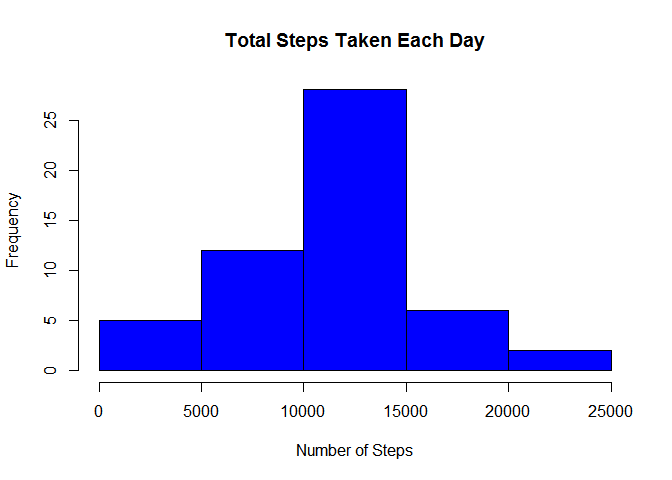
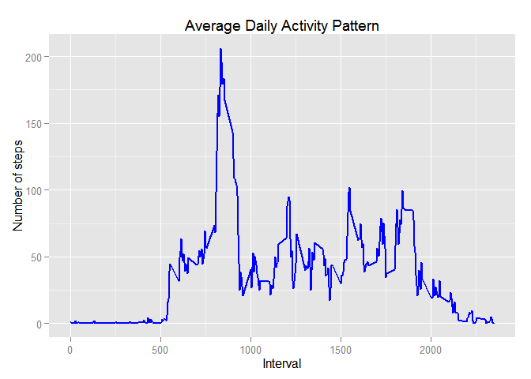
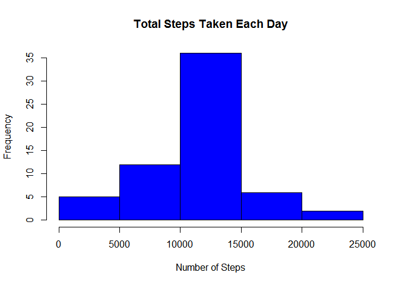
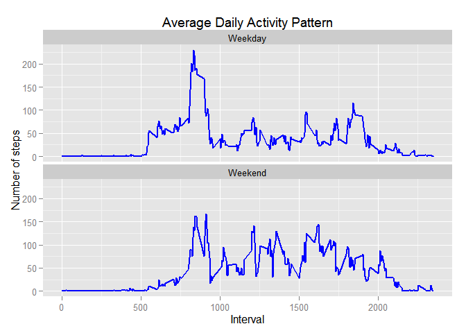

# Reproducible Research: Peer Assessment 1


## Loading and preprocessing the data
1. Load the data.


```r
# Import data
data <- read.csv('activity.csv')
```


2. Process/transform the data (if necessary) into a format suitable for your analysis.

```r
# Loading the libraries that I need
library(dplyr)
library(ggplot2)
library(plyr)

# Casting date column as Date
data$date <- as.Date(data$date)

# Ignoring missing values 
activity.data <- data[complete.cases(data),]  
```

## What is mean total number of steps taken per day?

1. Calculate the total number of steps taken per day

```r
daily.data <- ddply(activity.data, "date", summarise, total.steps= sum(steps))
```


2. Make a histogram of the total number of steps taken each day

```r
hist(daily.data$total.steps, main = "Total Steps Taken Each Day", col="blue", xlab="Number of Steps")
```

 


3. Calculate and report the mean and median of the total number of steps taken per day

```r
steps.day.mean <- mean(daily.data$total.steps)
print(steps.day.mean)
```

```
## [1] 10766.19
```

```r
steps.day.median <- median(daily.data$total.steps)
print(steps.day.median)
```

```
## [1] 10765
```

## What is the average daily activity pattern?

1. Make a time series plot (i.e. type = "l" ) of the 5minute interval (xaxis) and the average number of steps taken, averaged across all days (yaxis)

```r
interval.data <- ddply(activity.data, "interval", summarise, avg.steps= mean(steps))
ggplot(interval.data, aes(x=interval, y=avg.steps))+ 
  layer(geom="line") + 
  geom_line(color="blue", size=1) + 
  labs(title="Average Daily Activity Pattern", x="Interval", y="Number of steps") 
```

 


2. Which 5minute interval, on average across all the days in the dataset, contains the maximum number of steps?

```r
max.steps.interval <- interval.data[which.max(interval.data$avg.steps),]
print(max.steps.interval)
```

```
##     interval avg.steps
## 104      835  206.1698
```

## Imputing missing values
1. Calculate and report the total number of missing values in the dataset (i.e. the total number of rows with NA s)

```r
total.missing.values <- nrow(data[is.na(data),])
print(total.missing.values)
```

```
## [1] 2304
```


2. Devise a strategy for filling in all of the missing values in the dataset. The strategy does not need to be sophisticated. For example, you could use the mean/median for that day, or the mean for that 5minute interval, etc.
3. Create a new dataset that is equal to the original dataset but with the missing data filled in.

```r
# I filled the missing values using the mean for the interval. 
# For each value that was missing, I got the corresponding mean for that interval and set it to that value.
filled.data <- mutate(data, steps = ifelse(is.na(steps), interval.data[match(data$interval, interval.data$interval),2], steps))
```


4. Make a histogram of the total number of steps taken each day and Calculate and report the mean and median total number of steps taken per day. Do these values differ from the estimates from the first part of the assignment? What is the impact of imputing missing data on the estimates of the total daily number of steps?

```r
daily.filled.data <- ddply(filled.data, "date", summarise, total.steps= sum(steps))
hist(daily.filled.data$total.steps, main = "Total Steps Taken Each Day", col="blue", xlab="Number of Steps")
```

 

```r
filled.steps.day.mean <- mean(daily.filled.data$total.steps)
print(filled.steps.day.mean)
```

```
## [1] 10766.19
```

```r
filled.steps.day.median <- median(daily.filled.data$total.steps)
print(filled.steps.day.median)
```

```
## [1] 10766.19
```


## Are there differences in activity patterns between weekdays and weekends?
1. Create a new factor variable in the dataset with two levels - "weekday" and "weekend" indicating whether a given date is a weekday or weekend day.


```r
daily.filled.data <- mutate(filled.data, day.of.week = ifelse(weekdays(date) %in% c('Saturday','Sunday'), 'Weekend', 'Weekday'))
```

2. Make a panel plot containing a time series plot (i.e. type = "l" ) of the 5minute interval (xaxis) and the average number of steps taken, averaged across all weekday days or weekend days (yaxis). See the README file in the GitHub repository to see an example of what this plot should look like using simulated data.


```r
interval.daily.filled.data <- ddply(daily.filled.data, c('interval','day.of.week'), summarise, avg.steps= mean(steps))

ggplot(interval.daily.filled.data,  aes(x=interval, y=avg.steps))+ 
  layer(geom="line") + 
  geom_line(color="blue", size=1) + 
  facet_wrap(~ day.of.week, nrow=2, ncol=1) +
  labs(title="Average Daily Activity Pattern", x="Interval", y="Number of steps") 
```

 
